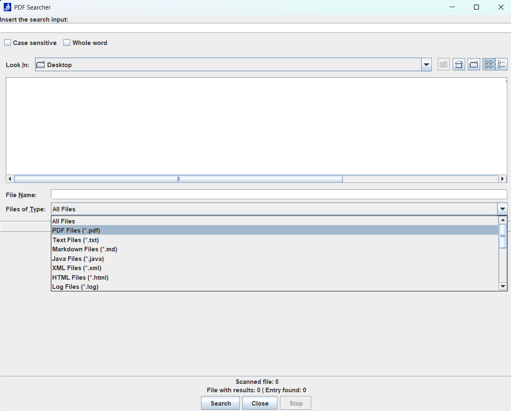

Simple Java code that allows fast search of a term in a single PDF file or in a directory of files.

If modified, use
```sh
    mvn clean install
```
to create the updated JAR file and
```sh
    java -jar .\target\pdf-search.jar
```
to execute the application.

If you are using windows you can call 
```sh
    .\compile_and_start_search.bat
```
to generate the new jar and launch it or
```sh
    .\start_search.bat
```
If you only want to execute it.

The following image shows the interactive GUI.


Once the search is completed, you can directly open the file by double-clicking on the corresponding "file" cell of the results table.
